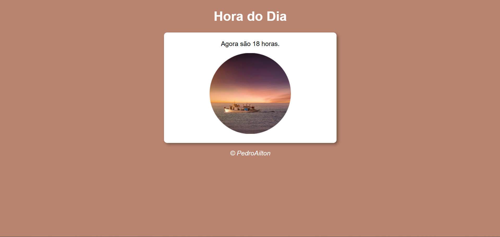
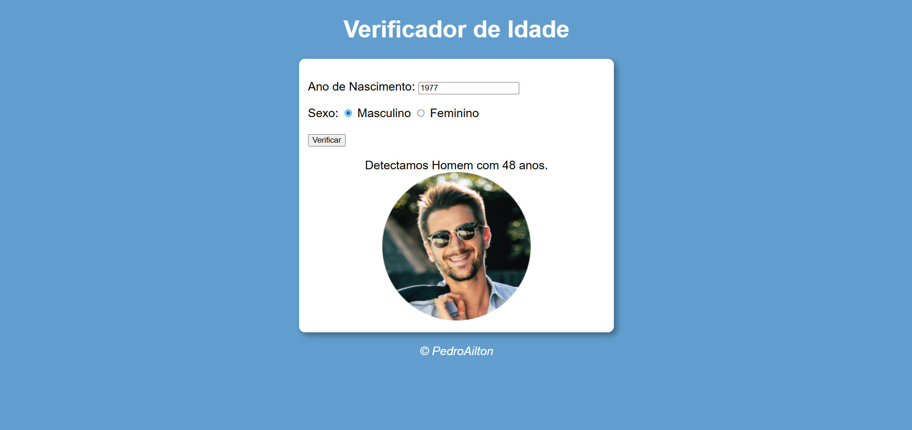
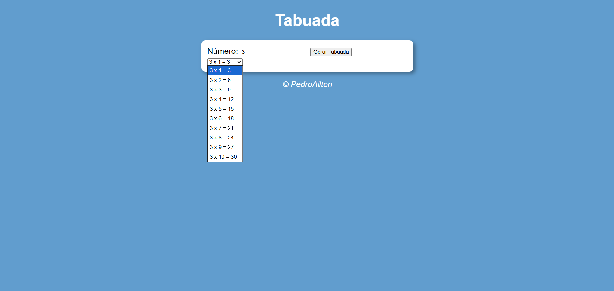
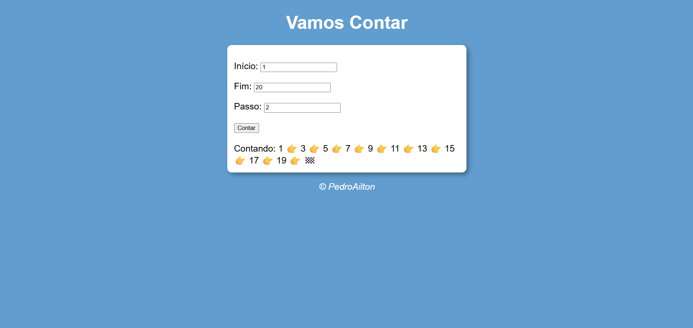

# Estudo Introdutório em JavaScript
Estudando JavaScript pelo curso do canal Curso em Vídeo no Youtube do professor Gustavo Guanabara com patrocínio do Google

## O Que Aprendi:

## Principais Projetos Desenvolvidos no Curso:
- Site Com Troca de Tema Dinâmica (Manhã, Tarde e Noite)
  
- Site Com Verificador de Idade Dinâmico
   
  
- Tabuada Dinâmica
   
  
- Analisador de Números
   
  
